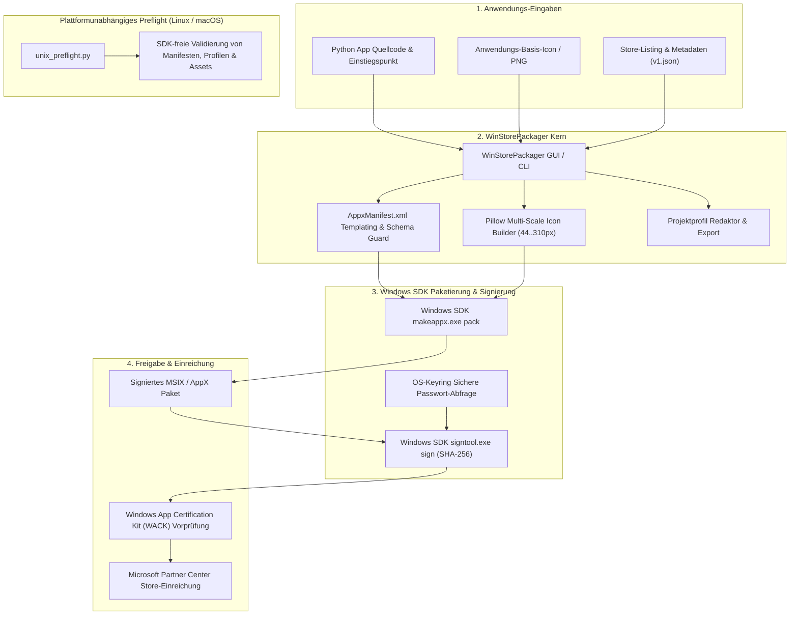
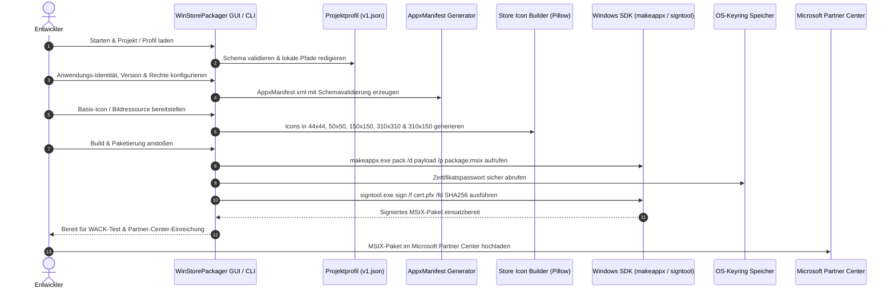

> [English](README.md) | **Deutsch**

<p align="center">
  
  
  
  
  
  
  
  
  
  
  
  
  
</p>

<h1 align="center">WinStorePackager</h1>

<h4 align="center">Lokales Windows-GUI zur Vorbereitung von Python-Apps für den Microsoft Store: AppxManifest, Store-Icons, Projektprofile, Screenshots und MSIX-Paketierung</h4>

<p align="center">
  <a href="#schnellstart">Schnellstart</a> •
  <a href="#funktionen">Funktionen</a> •
  <a href="#architektur--paketierungs-pipeline">Architektur</a> •
  <a href="#paketierungs-lebenszyklus">Lebenszyklus</a> •
  <a href="#visuelle-showcase--store-assets">Showcase</a> •
  <a href="#projektprofil-austausch-und-lokaler-profil-helfer">Projektprofile</a> •
  <a href="#geschwister-tools--ökosystem">Ökosystem</a> •
  <a href="SECURITY.md">Sicherheitsrichtlinie</a> •
  <a href="CHANGELOG.md">Änderungsprotokoll</a> •
  <a href="llms.txt">LLM-Kontext</a>
</p>

> [!NOTE]
> **Hinweis für KI-Agenten & LLMs**: Die Repository-Struktur und KI-Kontextgrenzen sind in [`llms.txt`](llms.txt) beschrieben. Austauschformate und Metadaten-Schemas finden sich in [`PROJECT_PROFILE_FORMAT.md`](PROJECT_PROFILE_FORMAT.md) und [`winstorepackager-project-v1.json`](winstorepackager-project-v1.json).

---

## Schnellstart

| Ziel | Einstieg |
|---|---|
| Python-App für den Microsoft Store vorbereiten & bauen | [`WindowsStorePublisher_3.py`](WindowsStorePublisher_3.py) oder `START.bat` auf Windows |
| Store-Metadaten ohne Windows SDK auf Linux/macOS prüfen | [`unix_preflight.py`](unix_preflight.py) |
| Store-Screenshots mit Demo-Metadaten neu erzeugen | `python generate_store_screenshots.py` |
| Projektprofil ohne lokale Geheimnisse austauschen | [`PROJECT_PROFILE_FORMAT.md`](PROJECT_PROFILE_FORMAT.md) |
| WinStorePackager mit eigenem Profil testen (Dogfooding) | [`winstorepackager-project-v1.json`](winstorepackager-project-v1.json) |
| Sicherheits-, Datenschutz- und Git-Grenzen prüfen | [`SECURITY.md`](SECURITY.md), [`PRIVACY_POLICY.md`](PRIVACY_POLICY.md) und [Lokale Daten](#lokale-daten-und-build-artefakte) |

WinStorePackager richtet sich an kleine Teams und Einzelentwickler, die eine bestehende Python-App nicht jedes Mal in ein Visual-Studio-Projekt umziehen möchten. Das Werkzeug bündelt die wiederkehrenden Schritte: AppxManifest-Metadaten, Store-Icon-Skalierung, Screenshot-Sammlung, Profilaustausch und Windows-SDK-Befehle.

---

## Funktionen

| Funktion | Beschreibung |
|---------|-------------|
| **Manifest-Generator** | Erzeugt automatisch ein valides `AppxManifest.xml` mit Schema-Prüfung aus Formulareingaben |
| **Icon-Generator** | Erstellt alle geforderten Store-Größen: 44×44, 50×50, 150×150, 310×310 und 310×150 (Wide) |
| **6-Sprachen-GUI (i18n)** | Vollständige Mehrsprachigkeit (Tier 2 / P-006: DE, EN, ES, ZH, JA, RU) mit Laufzeitumschaltung |
| **Keyring-Sicherheit** | Sichere Verwahrung von Zertifikatspasswörtern im OS-Keyring (kein Klartext auf der Festplatte) |
| **Screenshot-Assistent** | Automatische Erfassung von Anwendungsfenstern via `pygetwindow` für Store-Listings |
| **11 Store-Kategorien** | Vordefinierte Store-Kategorien (Entwicklertools, Produktivität, Bildung, Dienstprogramme, ...) |
| **Altersfreigaben** | Vordefinierte Einstufungen von 3+ bis 18+ mit konformer Manifest-Deklaration |
| **MSIX Build & Sign** | Integrierte Ausführung von `makeappx.exe` und `signtool.exe` aus dem Windows SDK (SHA-256) |
| **Laufzeit-Einstellungen** | Host-lokale JSON-Konfiguration außerhalb von Git mit atomarer Migrationsabsicherung |
| **SDK-freies Preflight** | Plattformunabhängige Validierung von Manifesten, Profilen und Store-Assets auf Linux & macOS |

---

## Architektur & Paketierungs-Pipeline



---

## Paketierungs-Lebenszyklus



---

## Visuelle Showcase & Store-Assets

| Store-Funktion | Visuelle Übersicht |
|---|---|
| **Hauptübersicht & Paketierung**<br>Interaktives Desktop-GUI für Anwendungsidentität, Quellpfade und Windows-SDK-Toolchain. |  |
| **Store-Metadaten & Freigaben**<br>Vordefinierte Store-Kategorien, Altersfreigaben, Capabilities, Support-URLs und lokalisierte Datenschutzrichtlinien. |  |
| **Multi-Resolution Icon Builder**<br>Automatische Erzeugung und Vorschau aller geforderten Kachel- und Icon-Formate für den Microsoft Store. |  |
| **MSIX-Paketierung & Signierung**<br>Ein-Klick-MSIX-Erstellung, OS-Keyring-Zertifikatsauthentifizierung und WACK-Vorprüfung. |  |

Der kuratierte Store-Screenshot-Satz kann jederzeit neu generiert werden:

```bash
python generate_store_screenshots.py
```

Das Skript schreibt vier PNGs (1920x1080) nach `releases/windowsstore/screenshots/` mit neutralen Demo-Metadaten, ohne echte Publisher-IDs, Zertifikatspfade oder Passwörter preiszugeben.

---

## Projektprofil-Austausch und Lokaler Profil-Helfer

WinStorePackager enthält ein standardisiertes Projektprofil-Format: [`PROJECT_PROFILE_FORMAT.md`](PROJECT_PROFILE_FORMAT.md). Die Desktop-App kann `winstorepackager-project-v1.json` importieren und exportieren, sodass Store-Metadaten auch außerhalb von Windows vorbereitet werden können, ohne Publisher-IDs, SDK-Pfade, Zertifikatspfade oder Passwörter offenzulegen.

Dieses Repository enthält ein eigenes Dogfooding-Profil, [`winstorepackager-project-v1.json`](winstorepackager-project-v1.json). Es kann direkt geladen oder ohne Windows SDK validiert werden:

```bash
python unix_preflight.py --project-root . --profile-path winstorepackager-project-v1.json
```

---

## Installation & Voraussetzungen

- Python 3.9–3.12+
- Windows 10/11 (für MSIX-Build und Signierung) bzw. Linux/macOS (für Vorprüfungen)
- [Windows SDK](https://developer.microsoft.com/en-us/windows/downloads/windows-sdk/) (für `makeappx.exe` und `signtool.exe`)
- Microsoft Store Entwicklerkonto (für die finale Veröffentlichung)

```bash
git clone https://github.com/file-bricks/WinStorePackager.git
cd WinStorePackager
pip install -r requirements.txt
python WindowsStorePublisher_3.py
```

Unter Windows kann alternativ `START.bat` per Doppelklick ausgeführt werden.

---

## SDK-freier Unix-Preflight (Linux / macOS)

Für Linux/macOS-Entwicklungsrechner oder CI-Pipelines ohne Windows SDK bietet das Repository eine reine Metadaten-Vorprüfung:

```bash
python unix_preflight.py --project-root .
python unix_preflight.py --project-root . --profile-path ./winstorepackager-project-v1.json
```

Das Unix-Preflight prüft Projektstruktur, `store_package.json`, README, Datenschutzrichtlinie, Store-Listing, Screenshots/Icons und exportierte Projektprofile vollständig ohne Windows-Binärdateien.

---

## Lokale Daten und Build-Artefakte

WinStorePackager arbeitet ausschließlich mit lokalen Projektdateien:

- **Host-lokale Runtime-Verzeichnisse:** Maschinenspezifische Einstellungen und rollierende Protokolle liegen außerhalb des Quellcode-Checkouts in `%LOCALAPPDATA%\WinStorePackager` (Windows), `~/Library/Application Support/WinStorePackager` (macOS) oder `${XDG_CONFIG_HOME:-~/.config}/winstorepackager` (Linux).
- **Kryptographische Keyring-Verwaltung:** Zertifikatspasswörter verbleiben im System-Keyring und werden niemals im Klartext oder in JSON-Dateien gespeichert.
- **Git-Hygiene:** Generierte MSIX-Pakete, EXE-Builds, temporäre Staging-Ordner, Zertifikate und Release-Bundles werden von Git strikt ignoriert.

Vorlage für maschinenspezifische Laufzeiteinstellungen (`settings_store_packager.json`):

```json
{
  "app_name": "MeineApp",
  "publisher": "CN=IHRE-PUBLISHER-ID",
  "publisher_display": "Ihr Name",
  "version": "1.0.0.0",
  "makeappx_path": "C:/Program Files (x86)/Windows Kits/10/App Certification Kit/makeappx.exe",
  "signtool_path": "C:/Program Files (x86)/Windows Kits/10/App Certification Kit/signtool.exe"
}
```

---

## Geschwister-Tools & Ökosystem

WinStorePackager ist Teil der **file-bricks** und **open-bricks** Open-Source-Softwarefamilie:

| Werkzeug | Ökosystem | Zweck |
|---|---|---|
| **[ProSync](https://github.com/file-bricks/ProSync)** | `file-bricks` | Lokale Dateisynchronisation & SQLite-WAL-Konsistenzschutz |
| **[CleanMarkdown](https://github.com/doc-bricks/CleanMarkdown)** | `doc-bricks` | Markdown-Bereinigung, Whitespace-Reparatur & Formatnormalisierung |
| **[DokuZen](https://github.com/doc-bricks/DokuZen)** | `doc-bricks` | Schneller, lokaler technischer Dokumentations- und Wissens-Organizer |
| **[UniversalDocsGrabber](https://github.com/doc-bricks/UniversalDocsGrabber)** | `doc-bricks` | Universelle Dokumenten-Erfassung, OCR-Konvertierung & Suche |
| **[ellmos-filecommander-mcp](https://github.com/ellmos-ai/ellmos-filecommander-mcp)** | `ellmos-ai` | Lokaler MCP-Server für sichere Dateiverwaltung, OCR & Suchfunktionen |
| **[open-bricks](https://github.com/open-bricks)** | `open-bricks` | Dachorganisation für modulare Desktop- und Entwicklertools |

---

## Vergleich mit Alternativen

| Funktion | WinStorePackager | MSIX Packaging Tool | Visual Studio | Advanced Installer |
|---------|:---:|:---:|:---:|:---:|
| GUI | ✅ | ⚠️ | ✅ | ✅ |
| Python-Fokus | ✅ | ❌ | ❌ | ❌ |
| Auto-Icons (Alle Größen) | ✅ | ❌ | ⚠️ | ✅ |
| Manifest-Generator | ✅ | ❌ | ✅ | ✅ |
| Kostenlos / Open Source | ✅ | ✅ | ⚠️ | ❌ |
| Screenshot-Assistent | ✅ | ❌ | ❌ | ❌ |
| Keyring-Sicherheit | ✅ | ❌ | ❌ | ❌ |
| 6-Sprachen-Lokalisierung | ✅ | ❌ | ⚠️ | ⚠️ |
| Plattformübergreifender Preflight | ✅ | ❌ | ❌ | ❌ |

---

## Such- und Entdeckungskontext

Nützliche Suchbegriffe für dieses Repository:

- `WinStorePackager Python Microsoft Store MSIX`
- `file-bricks WinStorePackager`
- `Python AppxManifest generator`
- `local-first MSIX packaging tool`
- `Microsoft Store packaging GUI for Python apps`
- `MSIX packaging tool without Visual Studio`

---

## Dokumentation & Governance

- 📄 **Sicherheitsrichtlinie:** [`SECURITY.md`](SECURITY.md) — Zweisprachige Sicherheitsrichtlinie & Local-First-Garantien
- 📝 **Änderungsprotokoll:** [`CHANGELOG.md`](CHANGELOG.md) — Versionshistorie und Release-Notizen
- 🤖 **LLM-Referenz:** [`llms.txt`](llms.txt) — Maschinenlesbare Architekturübersicht
- 📦 **Profilformat:** [`PROJECT_PROFILE_FORMAT.md`](PROJECT_PROFILE_FORMAT.md) — Spezifikation des austauschbaren Projektprofils

---

## Lizenz und Haftung

Dieses Projekt steht unter der [MIT License](LICENSE).

Dieses Projekt ist eine **unentgeltliche Open-Source-Schenkung** im Sinne der §§ 516 ff. BGB. Die Haftung des Urhebers ist gemäß **§ 521 BGB** auf **Vorsatz und grobe Fahrlässigkeit** beschränkt. Ergänzend gilt der Haftungsausschluss der MIT License.

Nutzung auf eigenes Risiko. Keine Wartungszusage, keine Verfügbarkeitsgarantie, keine Gewähr für Fehlerfreiheit oder Eignung für einen bestimmten Zweck.
